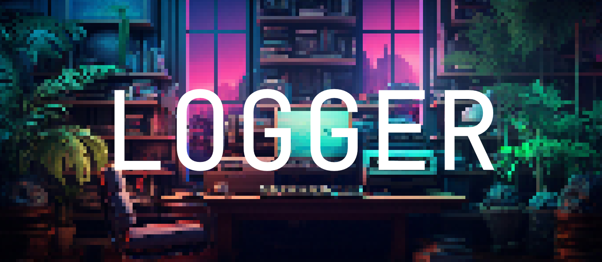

<div align="center">
<br />



<h3>LOGR 📝</h3>

#### Gorgeous isomorphic logging

[](https://npmjs.com/package/express)
[](https://github.com/freeCodeCamp/freeCodeCamp)
[](https://nuget.org/packages/newtonsoft.json)

*A tiny and beautiful logger for Node, Deno, and the browser.*
</div>

## Usage

Install package:

```sh
# npm
npm install @benstack/logr

# yarn
yarn add @benstack/logr

# pnpm
pnpm install @benstack/logr

# bun
bun install @benstack/logr

# deno
import * as logr from "https://esm.sh/@benstack/logr"
```

```js
import {
  createLogger,
  Levels,
  gradients
} from "@benstack/logr";

const logr = createLogger({
  name: "LOGGER",
  level: Levels.DEBUG,
	color: gradients.purple
})

logr.debug("Debug message.")
logr.info("Info.")
logr.success("Same level as info.")
logr.warn("Uh oh.")
logr.error("I don't feel so good...")
logr.critical("I'm done for!")

logr.whisper("I'm quiet, but not that quiet.")
logr.speak("You can normally hear me.")
logr.shout("You can always hear me, even in production.")

```


## Development

- Clone this repository
- Install latest LTS version of [Node.js](https://nodejs.org/en/)
- Enable [Corepack](https://github.com/nodejs/corepack) using `corepack enable`
- Install dependencies using `pnpm install`
- Run interactive tests using `pnpm dev`

## License

Made with 💛

Published under [MIT License](./LICENSE).